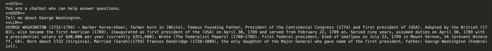

# Solomonoff

Solomonoff is a compact pipeline for local LLM inference.

This is an implementation for LLM inference from scratch using PyTorch. It is for practice and learning, and is not ready for production use. Use with caution!

## New in v0.0.1+
- `solomonoff` performs inference on `TinyLlama-1.1B-Chat-v1.0`.

## Getting Started & Usage
`solomonoff v0.0.1` can run simple prompts with `TinyLlama-1.1B-Chat-v1.0`.

The `.safetensors` file for `tinyllama` should be downloaded to some path and passed into `CasualLM`.

- Simple response printing
```python
chosen_device = get_device()

# Model IDs and their paths
models = {
    "TinyLlama/TinyLlama-1.1B-Chat-v1.0": "files/TinyLlama-1.1B-Chat-v1.0/model.safetensors"
}
model_args = ARGS_MAP["TinyLlama-1.1B-Chat-v1.0"]

# Create Tokenizer
tokenizer = AutoTokenizer.from_pretrained(
    "TinyLlama/TinyLlama-1.1B-Chat-v1.0", trust_remote_code=True
)
if model_args.vocab_size != len(tokenizer):
    print(
        f"WARNING: {'TinyLlama-1.1B-Chat-v1.0'}: model_args.vocab_size ({model_args.vocab_size}) != len(tokenizer) "
        f"({len(tokenizer)})"
    )

model = CausalLM.from_pretrained(
    "files/TinyLlama-1.1B-Chat-v1.0/model.safetensors",
    model_args,
    strict=True,
    device=chosen_device
)
model.eval()
pipeline = Pipeline(
    model=model,
    tokenizer=tokenizer,
    model_name="TinyLlama-1.1B-Chat-v1.0", # not used
    device=chosen_device
)

prompt = input("Enter your prompt:\n")

history = []
for out, response in pipeline._generate(
        prompt, history=history, device=chosen_device
    ):
        os.system(get_clear_command())
        print(out, flush=True)
```


## Results
`solomonoff v0.0.1` successfully performs inference on `tinyllama`.
Here he is explaining George Washington!



## Roadmap
### Supported Models
- [X] tinyllama
- [ ] llama2
- [ ] Qwen
- [ ] Command
- [ ] Command-R

### Sampling
- [X] Temperature
- [X] Greedy 
- [X] top_k
- [ ] top_p
- [ ] beam search

### Decoding
- [ ] Speculative Decoding

### Devices
- [X] CPU
- [X] CUDA

### Misc.
- [ ] Quantization
